Document Classifier
===================

Document classification tool based on a domain-dependent, keywords-based document class map and a simple keyword frequency score.

Currently only financial statements (in CSV format) can be classified. A keyword-based class map for a given document type (stored as a JSON file in `static`) is used to create a frequency score for keywords occurring in a user-specified list of columns in the CSV document.

Scoring & Classification Functions
----------------------------------

The scoring function, for a given CSV document and a list of keywords, is given by

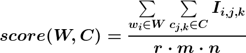

where  is the set of 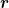 keywords 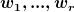 to search for,  is the user-defined set of  columns 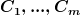 in which to perform the keyword search (the 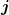-th column containing  strings 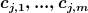), and 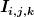 is an indicator function for the presence of keywords in the  column entries 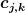 given by

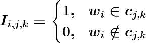

Note: the scoring function is guaranteed to be a value between 0 and 1 (inclusive) as the frequency score (numerator in the scoring function) can be a maximum of .

Given a CSV document  of type , with  classes 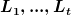 defined in its class keywords map (a JSON file with keys being the class names/IDs  and values being lists of keywords associated with the classes), and  being the user-defined set of columns in which to perform the keywords search, the classification function is given by

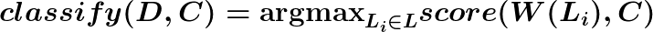

Usage
-----

Here's a simple example of classifying a sample income statement with only a single keywords-search column .

    [path/to/doc_classifier/src]$ ./classify.py -t 'financial statements' -f ../sample_data/income_statement/microsoft.csv --verbose

    Classification: income
    Keywords score map: {
        "income": 0.03428571428571429,
        "cash flow": 0.013333333333333334,
        "balance sheet": 0.0
    }

This is an example of classifying a sample income statement with multiple keywords-search columns.

    [/path/to/doc_classifier/src]$ ./classify.py -t 'financial statements' -f ../sample_data/income_statement/microsoft2.csv  -c 'line item 1, line item 2' --verbose

    Classification: income
    Keywords score map: {
        "income": 0.025714285714285714,
        "cash flow": 0.006666666666666667,
        "balance sheet": 0.0
    }
