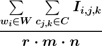
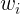
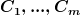
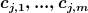
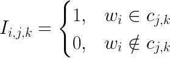
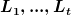
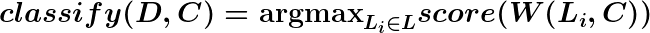

Document Classifier
===================

Document classification tool based on a simple keyword frequency-in-columns score.

Currently only financial statements (in CSV format) can be classified. A keyword-based class map for a given document type (stored as a JSON file in `src/static`) is used to create a frequency score for keywords occurring in a user-specified list of columns in the CSV document.

Scoring & Classification Functions
----------------------------------

The scoring function, for a given CSV document and a list of keywords, is given by

where  is the set of  keywords  to search for,  is the user-defined set of  columns  in which to perform the keyword search (the -th column containing  strings ), and  is an indicator function for the presence of keywords in the  column entries  given by

Given a CSV document  of type , with  classes  defined in its class keywords map (a JSON file with keys being the class names/IDs  and values being lists of keywords associated with the classes), and  being the user-defined set of columns to use as the basis for classification, the classification function is given by

Usage
-----

Examples below.

    [path/to/doc_classifier/src]$ ./classifier.py -t 'financial statements' -f ../sample_data/income_statement/microsoft.csv

    Classification: income

    [path/to/doc_classifier/src]$ ./classifier.py -t 'financial statements' -f ../sample_data/income_statement/microsoft.csv --verbose

    Classification: income
    Keywords score map: {
        "income": 0.03428571428571429,
        "cash flow": 0.013333333333333334,
        "balance sheet": 0.0
    }
